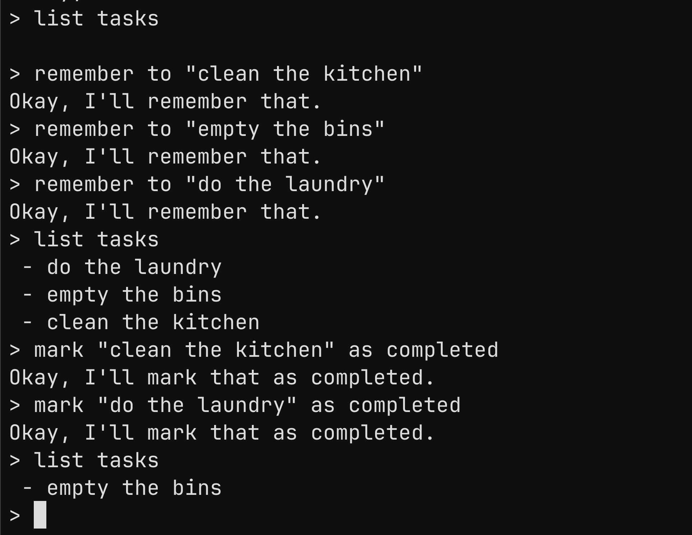

+++
authors = ["Pranav"]
title = "Stateful parsing with Megaparsec"
description = "Parsers are just transformers, what if we add a state monad to it?"
date = 2026-04-20
[taxonomies]
tags = ["Haskell", "Megaparsec", "Parsing", "Tutorial"]
[extra]
toc = true
+++

# Introduction

Recently, I've been learning about writing parsers using [megaparsec](https://hackage.haskell.org/package/megaparsec). I discovered a wonderfully comprehensive [guide](https://markkarpov.com/tutorial/megaparsec.html#the-monadparsec-type-class) by Mark Karpov on this matter.

Something that I wanted to implement in my parser was the ability to "remember" and "forget" information, essentially for the parser to have some internal state. I found the tutorial's explanation on this a bit confusing, I'm hoping this tutorial makes this a bit clearer for anyone else trying to something similar.

Over the course of this tutorial, we will be making a simple chatbot that manages a to-do list. Here's a sneak peek:



# Getting started

We can begin building our Megaparsec parser using the `Parsec` type. This type has quite a few parameters, and it looks (somewhat) like this:

```haskell
data Parsec e s a = Parsec e s a
```

Here, `e` is the custom error component type. This could be useful for more complicated parsers, but for now, we can use skip the hassle and use `Void` indicating that our parser doesn't define any custom errors. `s` is the input stream type. Since we are working with a simple stream of characters, `String` would be a suitable choice. Finally, `a` is the return type of the parser.

Instead of having to incant this obtuse type everywhere, its much more common to define a type synonym like the following. We haven't specified the return type just yet, this will allow for some flexibility later.

```haskell
import Text.Megaparsec
import Data.Void (Void)

-- NOTE: `Parser` is of kind * -> *
type Parser = Parsec Void String
```

Now that we defined a type for our parser, let's now write our first parser. We don't necessarily have to implement *everything* from scratch: `Text.Megaparsec`, `Text.Megaparsec.Char`, and `Text.Megaparsec.Char.Lexer` provide some useful building blocks for us to get started with. Here is an example:

```haskell
import Text.Megaparsec.Char

parseHello :: Parser ()
parseHello = do
  string "hello"
  pure ()
```

The type signature for our parser makes it clear what gets returned after a successful parse. In this case, it is the unit type. All that `parseHello` does is parse in the string "hello", and then return the unit type.

Returning the unit type doesn't really tell us much about what was just parsed. Our ultimate goal is to parse in some user request, and return some response. Let's define a custom datatype, `Response`, and then create various constructors for all the possible responses that can be given by our program.

```haskell
import Data.List (intercalate)

data Response = Remember | Complete | List [String]

instance Show Response where
  show Remember = "Okay, I'll remember that."
  show Complete = "Okay, I'll mark that as completed."
  show (List tasks) = intercalate "\n" $ map (" - " ++) tasks

parseRemember :: Parser Response
parseRemember = do
  string "remember to"
  pure Remember

parseComplete :: Parser Response
parseComplete = do
  string "mark as completed"
  pure Complete

parseList :: Parser Response
parseList = do
  string "list tasks"
  pure $ List [] -- Returning an empty list for now
```

I have added 3 new parsers here, each of which focuses on parsing in a specific type of user request, and returning the appropriate `Response` value. The `Show` instance for `Response` defines how the program should format the response when it gets printed onto the terminal.

Structuring parsers like this makes them read somewhat like a [BNF grammar](https://en.wikipedia.org/wiki/Backus%E2%80%93Naur_form)! It also helps us separate our concerns: each parser only has to worry about dealing with that specific request.

To combine these parsers together, we can use the alternative (`<|>`) operator. In the context of parsing, `a <|> b` would try running parser `a` first, and if it fails, it tries running `b`. The `choice` combinator also achieves something similar, but let's stick with the alternative operator for now:

```haskell
parseRequest :: Parser Response
parseRequest = parseRemember <|> parseComplete <|> parseList
```

We've written quite a few parsers by now, but we haven't actually run anything yet. To run parsers of type `Parsec` we can use the `runParser` function (synonymous to `parse`). It takes 3 arguments, the parser, the filename (not super important here, can be left blank), and the actual string we want to parse.

```haskell
runParser parseRequest "<stdin>" "list tasks"
```

This returns an `Either` type, which is either a `ParseErrorBundle`, or our parser's return type when the input was parsed successfully. Since our application is quite simple, we aren't going to be handling errors in depth. The `errorBundlePretty` function could be useful here if we were to do that: it converts an error bundle to a string that can be printed.

We can put this in a loop to create the REPL for our program.

```haskell
import Control.Monad (forever)
import System.IO (hSetBuffering, stdout, BufferMode(..))

loop :: IO ()
loop = forever $ do
  putStr "> "
  request <- getLine
  
  let eitherResponse = runParser parseRequest "<stdin>" request
  
  putStrLn $ case eitherResponse of
    Left _ -> "Sorry, I didn't understand that."
    Right response -> show response

main :: IO ()
main = do
  hSetBuffering stdout NoBuffering
  loop
```

The program should now be able to prompt the user for a string, and when one is provided, it will parse it. If any parse errors occur, and error message will be printed. If a request is successfully parsed, we format and convert the response to a string and print it. This logic loops over and over again.

At the moment, users cannot specify the names of the tasks they want our program to remember. To implement this, we must be able to define some sort of parser that can take in arbitrary strings. We'll accept strings surrounded by quotes, this makes parsing easy: the quotes make it clear where the string starts and ends. Here is a parser that does that:

```haskell
parseQuoted :: Parser String
parseQuoted = between (char '"') (char '"') (some $ anySingleBut '"')
```

The `between` combinator does exactly what it says; the first two arguments specify the starting and closing quotes, and the third argument is the string we want to return. Our string is a series of characters (except `"`). The `some` combinator specifies that our string can be arbitrarily long but must have atleast 1 character.

Now adding this to our request parsers:

```haskell
parseRemember :: Parser Response
parseRemember = do
  string "remember to "
  task <- parseQuoted
  
  pure Remember

parseComplete :: Parser Response
parseComplete = do
  string "mark " 
  task <- parseQuoted
  string " as completed"
  
  pure Complete
```

That's it for the introduction! So far, we implemented the REPL and the core parsing logic. This introduction is in no way a comprehensive introduction to megaparsec; once again, I strongly recommend that you check out Mark Karpov's [guide](https://markkarpov.com/tutorial/megaparsec.html#the-monadparsec-type-class) if you wish to learn more about the various inbuilt parsers and combinators. Now that we have gotten the fundamentals out of the way, we can focus on nitty gritty bit: implementing memory. 

# States

Currently the loop calls the exact same stateless logic every single time, so unsurprisingly, our chatbot cannot yet remember the tasks we ask it to remember.

One way we could address this is if our parsers could somehow accept the current state of its memory, say some type `s`, and return a modified version of it alongside the existing return type `a`. Our parsers would essentially act as state machines, returning not only the parsed data but some state data alongside that; this is analogous to the function `s -> (a, s)`. Our `loop` function would also need to be modified such that it calls itself with the correct state value every single time we parse something.

Implementing this ourselves seems quite tedious, is there any easier way to do this?

Those of you acquainted with the [mtl](https://hackage-content.haskell.org/package/mtl) might have already spotted this, but this idea of a state machine has already been implemented via the [State monad](https://hackage-content.haskell.org/package/mtl-2.3.2/docs/Control-Monad-State-Lazy.html)! In fact, the `s -> (a, s)` function we described is exactly what the `runState` does.

## A small lie

Previously, I stated that the `Parsec` is defined as the following:

```haskell
data Parsec e s a = Parsec e s a
```

However, this is not the case. `Parsec` is actually defined as a type synonym for `ParsecT`.

```haskell
type Parsec e s a = ParsecT e s Identity a
```

`ParsecT` seems quite similar to `Parsec`, with the addition of an extra type parameter `m`. As the suffix in its name might have indicated, `ParsecT` is actually a monad transformer; the extra parameter `m` is the underlying monad. In the case of `Parsec`, the underlying monad is `Identity`.

This discovery is a crucial one: since our parsers are transformers, they can access the powers of the monads that they are layered on top off. This means that we can add a `State` monad to our parser type, and we should get a type than can theoretically do parsing and keep track of some custom state.

```haskell
-- NOTE: `Parser` is of kind * -> *
type Parser = Parsec Void String (State Memory)
```

Here we are defining our custom state type to be `Memory`, we haven't yet implemented such a type so let us do that really quick.

```haskell
import Control.Monad.State
import Text.Megaparsec hiding (State)

newtype Memory = Memory [String]

initialMemory :: Memory
initialMemory = Memory []

remember :: (MonadState Memory m) => String -> m ()
remember task = modify remember'
  where
    remember' (Memory memory) = Memory $ task : filter (/= task) memory

forget :: (MonadState Memory m) => String -> m ()
forget task = modify forget'
  where
    forget' (Memory memory) = Memory $ filter (/= task) memory

recall :: (MonadState Memory m) => m [String]
recall = do
  (Memory memory) <- get
  pure memory

```

This custom memory type is just a thin wrapper over a string list. We have defined an initial state, `initial`, which is an empty list. This represents the state the chatbot starts at when it has 0 recorded tasks. `remember`, `forget`, and `recall` are all state actions to interact with the state monad, which does so via the `get` and `modify` functions. The types for them look a bit funky, but they allow interactions with the state monad from some other monad higher up in our transformer stack.

# Remembering stuff

Its quite simple to use the state actions we just implemented, we can treat them the same way we treat parser monads within do blocks. Adding these to the parsers we wrote earlier:

```haskell
parseRemember :: Parser Response
parseRemember = do
  string "remember to "
  task <- parseQuoted

  remember task

  pure Remember

parseComplete :: Parser Response
parseComplete = do
  string "mark "
  task <- parseQuoted
  string " as completed"

  forget task

  pure Complete

parseList :: Parser Response
parseList = do
  string "list tasks"

  tasks <- recall

  pure $ List tasks
```

It seems like we are finally done with our chatbot right? Well not quite. Thanks to how monad transformers work, all the parser functions we have written should work as is. What does break is our `loop` code.

We first update loop so that it gets called with an argument for the current memory state.

```haskell
loop :: Memory -> IO ()
loop memory = do
  -- Parsing and state logic...
  loop memory

main :: IO ()
main = do
  hSetBuffering stdout NoBuffering
  loop initialMemory
```

Now to run our parser, we need to use `runParserT` instead of `runParser` since we switched to using `ParsecT`. However, this won't return `eitherResponse` like before, but rather a state action. This is because transformer stacks are like onions, where we need to peel it layer by layer from the outside inwards. `runParserT` merely runs the outermost layer of our stack, that is, `ParsecT`. To get the response, we need to run the inner state action with `runState`, which returns both our desired response as well as the new memory state.

```haskell
loop :: Memory -> IO ()
loop memory = do
  putStr "> "
  request <- getLine

  let stateAction = runParserT parseRequest "<stdin>" request
  let (eitherResponse, newMemory) = runState stateAction memory

  putStrLn $ case eitherResponse of
    Left _ -> "Sorry, I didn't understand that."
    Right response -> show response

  loop newMemory
```

And that's it! The chatbot should fully be working as initially demonstrated!

---

# Full source code

```haskell
import Control.Monad.State
import Data.List (intercalate)
import Data.Void (Void)
import System.IO (hSetBuffering, stdout, BufferMode(..))
import Text.Megaparsec hiding (State)
import Text.Megaparsec.Char

newtype Memory = Memory [String]

initialMemory :: Memory
initialMemory = Memory []

remember :: (MonadState Memory m) => String -> m ()
remember task = modify remember'
  where
    remember' (Memory memory) = Memory $ task : filter (/= task) memory

forget :: (MonadState Memory m) => String -> m ()
forget task = modify forget'
  where
    forget' (Memory memory) = Memory $ filter (/= task) memory

recall :: (MonadState Memory m) => m [String]
recall = do
  (Memory memory) <- get
  pure memory

type Parser = ParsecT Void String (State Memory)

data Response = Remember | Complete | List [String]

instance Show Response where
  show Remember = "Okay, I'll remember that."
  show Complete = "Okay, I'll mark that as completed."
  show (List tasks) = intercalate "\n" $ map (" - " ++) tasks

parseQuoted :: Parser String
parseQuoted = between (char '"') (char '"') (some $ anySingleBut '"')

parseRemember :: Parser Response
parseRemember = do
  string "remember to "
  task <- parseQuoted

  remember task

  pure Remember

parseComplete :: Parser Response
parseComplete = do
  string "mark "
  task <- parseQuoted
  string " as completed"

  forget task

  pure Complete

parseList :: Parser Response
parseList = do
  string "list tasks"

  tasks <- recall

  pure $ List tasks

parseRequest :: Parser Response
parseRequest = parseRemember <|> parseComplete <|> parseList

loop :: Memory -> IO ()
loop memory = do
  putStr "> "
  request <- getLine

  let stateAction = runParserT parseRequest "<stdin>" request
  let (eitherResponse, newMemory) = runState stateAction memory

  putStrLn $ case eitherResponse of
    Left _ -> "Sorry, I didn't understand that."
    Right response -> show response

  loop newMemory

main :: IO ()
main = do
  hSetBuffering stdout NoBuffering
  loop initialMemory
```
